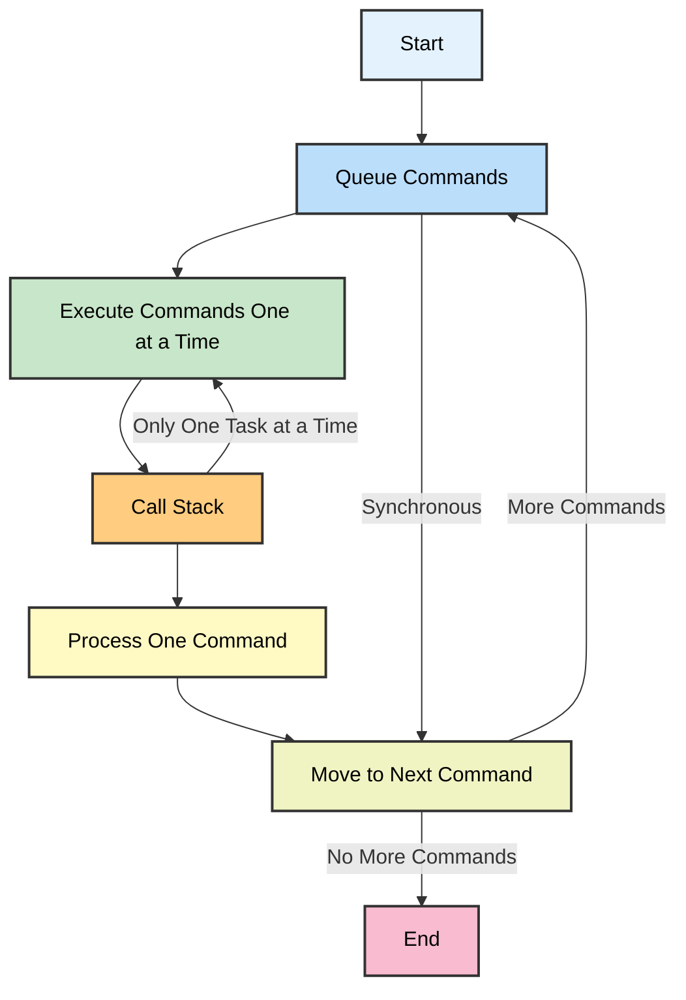
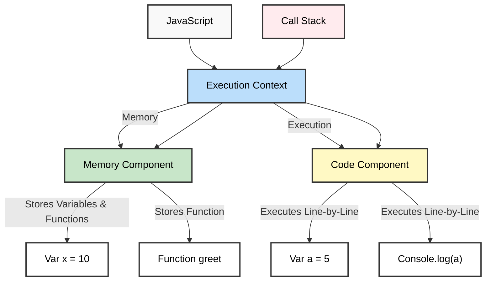

### **JavaScript Characteristics**

#### **Synchronous and Single-Threaded**

- JavaScript is **synchronous**, meaning it executes commands one at a time in a specific order.
- It is also **single-threaded**, meaning only one command is processed at any given time.
- JavaScript is single-threaded because it has only one call stack, allowing it to execute one command at a time in a specific order.


#### **Call Stack**

The call stack is a mechanism that keeps track of function executions in JavaScript. It follows a Last In, First Out (LIFO) principle.
### **Execution Context**

At the core of JavaScript’s operation is the **Execution Context**, which is created whenever a script or function is executed. The execution context consists of two main components:

##### **1. Memory Component (Variable Environment)**

- **Stores variables and functions as key-value pairs**.
- This is where JavaScript keeps track of all the declared variables and functions during execution.

```
var x = 10; // Stored as {x: 10}
function greet() { console.log("Hello!"); } // Stored as {greet: function}
```
#### **2. Code Component (Thread of Execution)**

- **Executes code line by line**.
- This component reads instructions and performs operations in a defined sequence.

```
var a = 5; // Memory component updates: {a: 5}
console.log(a); // Code component executes: prints 5
```




