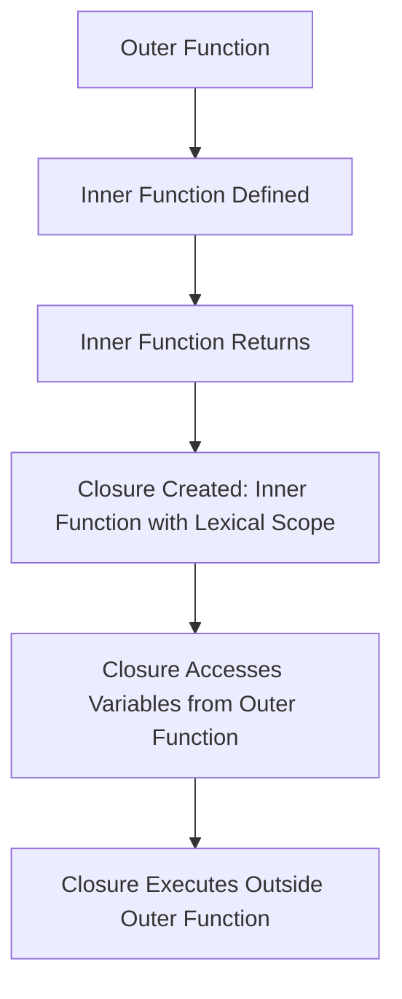

### **Closures in JavaScript**

A **closure** is a powerful concept in JavaScript where a function "remembers" its lexical scope, even when it is executed outside that scope. In simpler terms, closures allow a function to access variables from its outer function even after the outer function has finished execution.

### **1. What is a Closure?**

A **closure** occurs when a function is defined within another function and gains access to the outer function's variables, even after the outer function has finished executing. This happens because the inner function "remembers" the scope in which it was created.

Example -  the function `y()` is a closure that has access to the variable `a` from the outer function `x()`.
```
function x() {
  var a = 7;
  function y() {
    console.log(a);  // Accesses variable 'a' from outer scope
  }
  y();  // Outputs: 7
}
x();
```

### **2. Closure Example with Functions Inside Functions**

You can assign a function to a variable or even return a function from another function, creating a closure.
#### Example 1: Function Inside Function
Here, the inner function `y` is called and it remembers the variable `a` from the outer function scope.
```
function x() {
  var a = function y() {
    console.log(a);  // Accesses 'a' from outer function scope
  };
  y();  // Outputs: function y() { console.log(a); }
}

x();
```
#### Example 2: Returning a Function
```
function x() {
  var a = 7;
  function y() {
    console.log(a);  // Accesses 'a' from outer scope
  }
  return y;
}

var z = x();
console.log(z);  // Outputs: function y() { console.log(a); }
z();  // Outputs: 7
```
The function `y()` is returned from `x()` and is assigned to `z`. Even though `x()` has finished executing, `z` (which is `y()`) still has access to `a` from the outer scope, demonstrating the closure.
### **3. How Closures Work**

A closure is essentially a combination of a function and its lexical environment (the scope in which it was defined). The inner function has access to variables declared in its outer function, even after the outer function has completed execution.
Example - 
```
function outer() {
  var outerVar = 'I am outer';
  function inner() {
    console.log(outerVar);  // Closure: inner function remembers outer function's variable
  }
  return inner;
}

var closureFunc = outer();
closureFunc();  // Outputs: I am outer
```
Here, `closureFunc()` retains access to `outerVar` because of the closure formed by the inner function `inner` and its lexical environment.
### **4. Uses of Closures**

Closures are widely used in JavaScript for various purposes. Here are some common use cases:

#### **1. Module Design Pattern**

Closures allow us to create private variables and methods in JavaScript, which are not directly accessible from outside the function, but can be interacted with through returned functions.
Example - 
```
var counter = (function() {
  var count = 0;
  return {
    increment: function() {
      count++;
      return count;
    },
    decrement: function() {
      count--;
      return count;
    },
    getCount: function() {
      return count;
    }
  };
})();

console.log(counter.increment());  // Outputs: 1
console.log(counter.getCount());  // Outputs: 1
```
#### **3. Functions like Once**

A function that can only be called once can be created using closures.
```
function once(fn) {
  var executed = false;
  return function() {
    if (!executed) {
      fn();
      executed = true;
    }
  };
}

var greetOnce = once(function() {
  console.log('Hello!');
});

greetOnce();  // Outputs: Hello!
greetOnce();  // No output, since the function is executed only once
```
#### **4. Memoization**

Closures are used to optimize functions by caching results of expensive function calls.
```
function memoize(fn) {
  var cache = {};
  return function(arg) {
    if (cache[arg]) {
      return cache[arg];
    }
    var result = fn(arg);
    cache[arg] = result;
    return result;
  };
}

var square = memoize(function(x) {
  console.log('Calculating square...');
  return x * x;
});

console.log(square(4));  // Outputs: Calculating square... 16
console.log(square(4));  // Outputs: 16 (cached result)
```
#### **5. Maintaining State in an Async World**

Closures help in maintaining state in asynchronous operations, like setTimeout or event handlers.
```
for (var i = 1; i <= 3; i++) {
  setTimeout(function() {
    console.log(i);  // Outputs: 4, 4, 4
  }, 1000);
}

// Fix using closures
for (var i = 1; i <= 3; i++) {
  (function(i) {
    setTimeout(function() {
      console.log(i);  // Outputs: 1, 2, 3
    }, 1000);
  })(i);
}
```
#### **6. Iterators**

Closures are used to create iterators, which help in traversing through data structures like arrays or objects.
```
function createCounter() {
  var count = 0;
  return {
    increment: function() {
      return ++count;
    },
    decrement: function() {
      return --count;
    },
    getCount: function() {
      return count;
    }
  };
}

var counter = createCounter();
console.log(counter.increment());  // Outputs: 1
console.log(counter.increment());  // Outputs: 2
console.log(counter.getCount());  // Outputs: 2
```

### **Questions**

#### **1. What is a closure in JavaScript?**

**Answer**: A closure is a function that "remembers" its lexical scope, even when it is executed outside that scope. It allows an inner function to access variables from its outer function.

#### **2. Can you give an example of closure in JavaScript?**

**Answer**: Yes, a closure occurs when an inner function retains access to variables from its outer function even after the outer function has finished executing. Example:
Example - 
```
function outer() {
  var outerVar = 'I am outer';
  function inner() {
    console.log(outerVar);
  }
  return inner;
}

var closureFunc = outer();
closureFunc();  // Outputs: I am outer
```
#### **3. How can closures be useful in JavaScript?**

**Answer**: Closures are useful for creating private variables, currying, memoization, maintaining state in asynchronous code, and implementing patterns like module design and iterators.

#### **4. How do closures help with asynchronous code?**

**Answer**: Closures allow functions to maintain their state even after they are executed asynchronously (e.g., inside `setTimeout`, promises, or event handlers), preserving variable values in a given context.