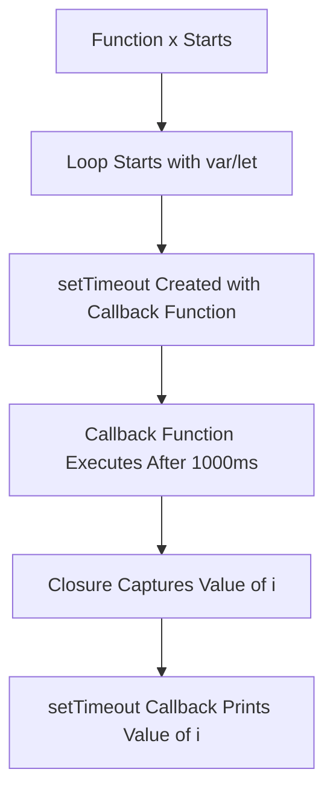

The `setTimeout` function is commonly used to delay the execution of code in JavaScript. 
It allows us to run a function after a specified delay, in milliseconds. 
When used in conjunction with closures, `setTimeout` can lead to unexpected results, especially when dealing with loop variables or variables declared with `var` (which are function-scoped).
### **1. Understanding `setTimeout`**

The `setTimeout` function takes two arguments:

1. A **callback function** that will be executed after the specified time delay.
2. A **time delay** (in milliseconds) which specifies when the callback function should be executed.
Example - This will print "Hello after 1 second!" after 1 second.
```
setTimeout(function() {
  console.log('Hello after 1 second!');
}, 1000);  // Delays execution by 1000ms (1 second)
```

### **2. setTimeout + Closures**

When using `setTimeout` inside functions, closures come into play. A closure allows the callback function to remember its surrounding state, such as variables defined in the outer function, even after that function has completed execution.
Example 1: `setTimeout` Inside a Function
- In this example, the inner function inside `setTimeout` is a closure because it "remembers" the variable `i` from its outer scope (function `x()`).
- After 1 second, `i` is printed as `1`.
```
function x() {
  var i = 1;
  setTimeout(function() {
    console.log(i);  // Accesses 'i' from the outer function scope due to closure
  }, 1000);
}

x();  // Outputs: 1 after 1 second

```
### **3. Common Issue with `setTimeout` in Loops (Using `var`)**

The issue arises when `setTimeout` is used inside a loop and the loop variable is declared with `var`. This is because `var` is function-scoped, not block-scoped, so all `setTimeout` callbacks share the same `i` variable, which leads to unexpected results when the delay completes.

#### Example 2: Issue with `setTimeout` in a Loop
- In this example, `i` is not block-scoped (because `var` is function-scoped), so all `setTimeout` functions share the same `i`, which ends up being `4` after the loop finishes.
- All callbacks output `4` after the 1-second delay, even though we expected them to output `1`, `2`, and `3`.
```
function x() {
  for (var i = 1; i <= 3; i++) {
    setTimeout(function() {
      console.log(i);  // All outputs will be '4' due to closure capturing 'i'
    }, 1000);
  }
}

x();  // Outputs: 4, 4, 4 after 1 second
```

### **4. Fixing the Issue with `let` (Block Scope)**

To fix this, we can use `let` instead of `var`. `let` is block-scoped, meaning each iteration of the loop will have its own separate `i`.

#### Example 3: Fix with `let`
Here, `let` ensures that each iteration has its own `i`, so the callback functions each print the expected value `1`, `2`, and `3`.

```
function x() {
  for (let i = 1; i <= 3; i++) {
    setTimeout(function() {
      console.log(i);  // Each callback captures its own value of 'i'
    }, 1000);
  }
}

x();  // Outputs: 1, 2, 3 after 1 second
```




### **Questions**

#### **1. What is the behavior of `setTimeout` in JavaScript?**

**Answer**: `setTimeout` is used to execute a function after a specified delay. It takes two arguments: a callback function and the delay in milliseconds.

#### **2. What issue occurs when using `setTimeout` inside a loop with `var`?**

**Answer**: The issue is that `var` is function-scoped, meaning all `setTimeout` callbacks share the same variable. This leads to unexpected results where all callbacks print the same final value after the loop finishes executing.

#### **3. How can you fix the issue with `setTimeout` in a loop?**

**Answer**: The issue can be fixed by using `let` instead of `var`, since `let` is block-scoped and each iteration will have its own value of the loop variable.
```
for (let i = 1; i <= 3; i++) {
  setTimeout(function() {
    console.log(i);
  }, 1000);
}
```
#### **4. Explain how closures work with `setTimeout`.**

**Answer**: A closure occurs when the `setTimeout` callback function remembers the variables from its outer function scope. This allows it to access variables from the enclosing function even after that function has finished executing.

#### **5. What happens if you use `var` instead of `let` inside a loop with `setTimeout`?**

**Answer**: If `var` is used, all `setTimeout` callbacks will share the same `i` variable, and by the time the callbacks are executed, `i` will have its final value, causing all of them to output the same value.