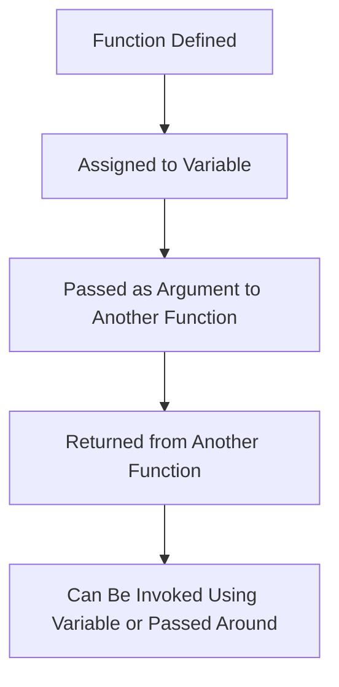

In JavaScript, functions are **first-class citizens**, meaning they can be treated as values. They can be assigned to variables, passed as arguments to other functions, and even returned from other functions.
### **1. Function Declaration vs Function Expression**

#### **Function Declaration**

A function declaration defines a named function that can be called at any point in the code, even before the function is declared. This is because **function declarations are hoisted** to the top of their scope.
Example - **Hoisting**: The function declaration is hoisted, so you can call `a()` before the function is defined.
```
function a() {
  console.log("a is called");
}
a();  // Outputs: "a is called"
```
#### **Function Expression**

A function expression assigns a function to a variable. The function is **not hoisted**, meaning you cannot call it before it is defined.
Example - **Hoisting**: The variable `b` is hoisted, but it is assigned `undefined` until the function expression is encountered, so calling `b()` before the assignment will throw an error.

```
var b = function() {
  console.log("b is called");
};

b();  // Outputs: "b is called"
```

calling `a()` works because function declarations are hoisted, but calling `b()` before the function expression results in an error because the variable `b` is hoisted but not yet assigned a function.

```
// Function Declaration
a();  // Outputs: "a is called"
function a() {
  console.log("a is called");
}

// Function Expression
b();  // Error: b is not a function
var b = function() {
  console.log("b is called");
};
```
### **2. Anonymous Functions**

An **anonymous function** is a function that does not have a name. Anonymous functions are often used as function expressions or callbacks.
```
var c = function() {
  console.log("Anonymous function called");
};

c();  // Outputs: "Anonymous function called"
```
While anonymous functions are common, they cannot be called by their function name because they don't have one.
### **3. Named Function Expression**

A **named function expression** is similar to an anonymous function, but the function is given a name. This name can only be used within the function itself.
Example - The function is still assigned to the variable `d`, and you can call it using `d()`, but you cannot call it using `namedFunction()` outside of its expression.
```
var d = function namedFunction() {
  console.log("Named function expression called");
};

d();  // Outputs: "Named function expression called"
```

 ### **4. First Class Functions**

Functions in JavaScript are considered first-class citizens, meaning they can be:

1. Assigned to variables.
2. Passed as arguments to other functions.
3. Returned from other functions.

#### Example 1: Functions as Values
The function is assigned to the variable `add`, and can be called using `add()`.
```
var add = function(a, b) {
  return a + b;
};

console.log(add(3, 4));  // Outputs: 7
```
#### Example 2: Functions as Arguments

Here, the callback function is passed as an argument to the `greet` function.
```
function greet(name, callback) {
  console.log("Hello, " + name);
  callback();
}

greet("Alice", function() {
  console.log("Callback function executed!");
});
```

Example 3: Functions Returning Other Functions
The function `multiplier` returns another function, which can then be called with different arguments.
```
function multiplier(factor) {
  return function(x) {
    return x * factor;
  };
}

var multiplyBy2 = multiplier(2);
console.log(multiplyBy2(5));  // Outputs: 10
```



### **Questions**

#### **1. What are the differences between function declarations and function expressions?**

**Answer**:

- **Function declarations** are hoisted to the top of their scope and can be called before their definition.
- **Function expressions** are not hoisted, and you cannot call them before their definition.

#### **2. What is the difference between an anonymous function and a named function expression?**

**Answer**:

- An **anonymous function** has no name and is typically used as a function expression or callback.
- A **named function expression** has a name, but the name is only accessible inside the function itself and cannot be used outside.

#### **3. What are first-class functions in JavaScript?**

**Answer**: First-class functions mean that functions can be treated as values. They can be assigned to variables, passed as arguments to other functions, and returned from other functions.

#### **4. What is the advantage of using first-class functions in JavaScript?**

**Answer**: First-class functions allow for more flexible code, including functional programming techniques like callbacks, higher-order functions, and closures.