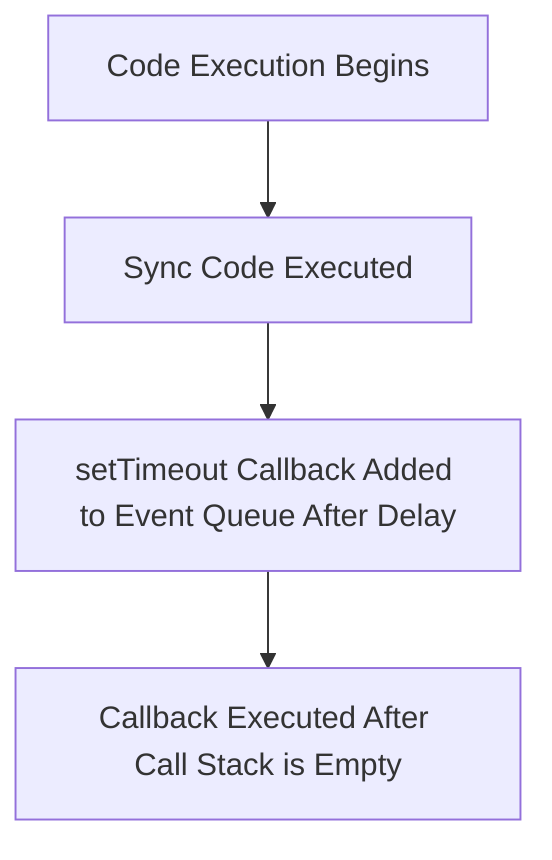

A **callback function** is a function passed into another function as an argument, which is then invoked inside that function. 

Callbacks are particularly useful for handling asynchronous operations, allowing us to execute code after a certain operation completes (e.g., after waiting for an event, completing a timeout, or receiving data).

### **Example 1: Callback with setTimeout**

In this example, we use a callback function to execute code after a specified delay. The code first prints `x` and `y`, and after 5000 milliseconds, the callback function inside `setTimeout` is executed.

```
console.log("x");
console.log("y");

setTimeout(function() {
  console.log("Timer completed");
}, 5000);
```
**Execution Flow**:

1. The synchronous `console.log("x")` and `console.log("y")` are executed first and printed.
2. `setTimeout()` is called with a callback function, but since it's asynchronous, it doesn't block the further execution of the program.
3. After the 5000 ms delay, the callback inside `setTimeout()` is added to the event queue and executed once the call stack is empty.
---
### **Asynchronous Nature of Callbacks**

A callback function allows you to perform **asynchronous operations** in JavaScript. Instead of blocking the execution of further code while waiting for an operation (like an API call or timer), the callback lets you continue with other tasks, only executing the callback when the asynchronous operation completes.

----
### **Example 2: Callback for Event Handlers**

Event listeners are often used to handle user interactions asynchronously. When you click a button, an event listener waits for the click event, and once it occurs, the callback function is executed.

#### Without Using Callback:

```
// Without callback
document.getElementById("button").onclick = function() {
  console.log("Button clicked!");
};
```
#### Using Callback:

```
// With callback (closure)
function buttonClickHandler() {
  console.log("Button clicked!");
}

document.getElementById("button").addEventListener("click", buttonClickHandler);
```

In this case, the callback function `buttonClickHandler` is passed as an argument to `addEventListener`. The function is invoked only when the click event happens.

### **Why Do We Remove Event Listeners?**

Event listeners can consume memory and resources if not properly removed. If an event listener is added to an element and never removed, it keeps a reference to the function, preventing the memory used by the event listener from being freed. This can lead to memory leaks, especially if the element or event listener is no longer needed.

#### **Memory Issues:**

- **Event listeners are persistent**: They keep the callback function in memory, even if the page is loaded and unloaded.
- **Potential memory leak**: If event listeners are not removed, they continue consuming memory.

#### **Removing Event Listeners:**
The `removeEventListener` method helps in cleaning up the event listener when it's no longer necessary.
```
function buttonClickHandler() {
  console.log("Button clicked!");
}

// Add event listener
document.getElementById("button").addEventListener("click", buttonClickHandler);

// Remove event listener
document.getElementById("button").removeEventListener("click", buttonClickHandler);
```



### **Questions**

#### **1. What is a callback function in JavaScript?**

**Answer**: A callback function is a function passed into another function as an argument, which is executed when the other function completes. It is commonly used for handling asynchronous operations.

#### **2. How does a callback function work with setTimeout()?**

**Answer**: `setTimeout()` is used to execute a callback function after a specified delay. The callback is added to the event queue and is executed after the delay once the call stack is empty.

#### **3. Why do we remove event listeners in JavaScript?**

**Answer**: We remove event listeners to prevent memory leaks. If an event listener is not removed, it will continue consuming memory, even if the element or page is no longer in use.

#### **4. What is the difference between event handlers and event listeners?**

**Answer**:

- **Event handlers** are properties of elements (like `onclick`), and they can only be assigned one function.
- **Event listeners** are methods (like `addEventListener`) that can be assigned multiple functions to handle the same event.