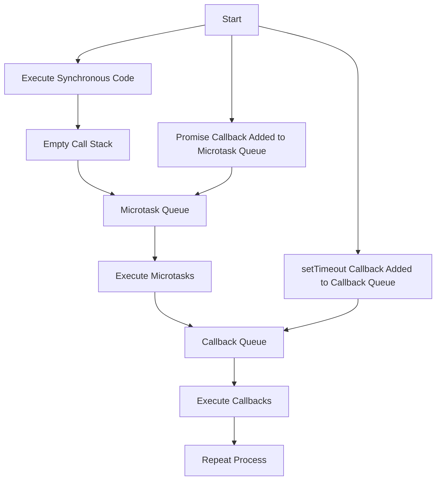

JavaScript is single-threaded, meaning it can only execute one task at a time. However, it can handle asynchronous operations like timers, API calls, and DOM events using a combination of the **call stack**, **event loop**, **callback queue**, and **microtask queue**.
### **Global Execution Context (GEC)**

The **Global Execution Context** is the default environment where JavaScript code is executed. It has two components:

1. **Memory Component (Variable Environment)**: Stores variables and functions.
2. **Code Component**: Executes code line by line.

When a script is run, it creates a global execution context, and the **call stack** is used to manage the execution of all tasks.

----
### **Function Call Execution Context**

When a function is called (e.g., `a()`), a new **Execution Context** is created for that function. It includes its own memory and code components. This is added to the **call stack**.

---
### **Web APIs**

Web APIs are built-in browser features that are not part of JavaScript but are available in the browser environment. These include:

- **setTimeout()**
- **DOM APIs** (e.g., `document.getElementById`)
- **fetch()**
- **Local Storage**
- **console**
- **location**

These APIs allow JavaScript to interact with the browser and perform asynchronous tasks like fetching data, manipulating the DOM, and handling events. They are accessible through the `window` object in the browser.

Example - setTimeout() 
```
console.log("Start");

setTimeout(function cb() {
  console.log("Callback");
}, 5000);

console.log("End");
```

**Execution Flow**:
1. **Start** is logged immediately.
2. **setTimeout()** schedules the callback function to run after 5000ms but does not block the execution of subsequent code.
3. **End** is logged next.
4. After 5000ms, the callback is moved to the **callback queue**.
5. The **event loop** checks the call stack and pushes the callback function to the call stack when it is empty.
6. The callback function is executed, logging **Callback**.
---
### **Event Loop and Callback Queue**

The **Event Loop** is a mechanism that ensures asynchronous operations (such as callbacks) are executed after the synchronous code in the **call stack** finishes.

- The event loop continuously checks the **callback queue** to see if there are any callbacks ready to be executed.
- Once the call stack is empty, the event loop pushes the next item from the callback queue to the call stack for execution.
Example - addEventListener()
```
console.log("Start");

document.getElementById("btn").addEventListener("click", function cb() {
  console.log("Callback");
});

console.log("End");
```
---
### **Microtask Queue**

The **Microtask Queue** is similar to the callback queue but has higher priority. It holds callbacks from:

- **Promises**
- **MutationObserver** (for DOM changes)

When the **call stack** is empty, the **event loop** first checks the **microtask queue** before processing the **callback queue**.

Promises and Microtask Queue 
```
console.log("Start");

setTimeout(function cb() {
  console.log("Callback from setTimeout");
}, 0);

Promise.resolve().then(function() {
  console.log("Callback from Promise");
});

console.log("End");
```
**Execution Flow**:
1. **Start** is logged first.
2. The `setTimeout()` function is scheduled, but with a delay of 0ms, so it goes to the callback queue.
3. The promise resolves and its `.then()` callback is added to the **microtask queue**.
4. **End** is logged.
5. After the synchronous code finishes, the event loop checks the **microtask queue** and executes the promise callback (`Callback from Promise`).
6. Finally, the event loop checks the **callback queue** and executes the `setTimeout()` callback (`Callback from setTimeout`).
### **Event Loop and Execution Order**

The **event loop** prioritizes the execution of tasks based on the type of queue:

1. **Microtask Queue** (higher priority) – includes tasks like promise resolutions.
2. **Callback Queue** (lower priority) – includes tasks like `setTimeout()` callbacks and event handlers.

The event loop ensures that microtasks are completed before processing the callback queue.




### **Questions**

#### **1. What is the event loop in JavaScript?**

**Answer**: The event loop is a mechanism that allows JavaScript to handle asynchronous operations by continuously checking the callback queue and executing tasks once the call stack is empty.

#### **2. What is the difference between the callback queue and the microtask queue?**

**Answer**: The **microtask queue** has higher priority than the **callback queue**. Microtasks (such as promise callbacks) are executed before tasks in the callback queue (like `setTimeout()` callbacks).

#### **3. Explain the role of the event loop in handling asynchronous code.**

**Answer**: The event loop monitors the callback queue and microtask queue, ensuring that asynchronous code is executed in the correct order, giving priority to microtasks before handling regular callbacks.

#### **4. How does `setTimeout()` work in JavaScript?**

**Answer**: `setTimeout()` schedules a callback function to run after a specified delay. However, it does not block the execution of other code. The callback is added to the callback queue after the specified delay and is executed when the call stack is empty.