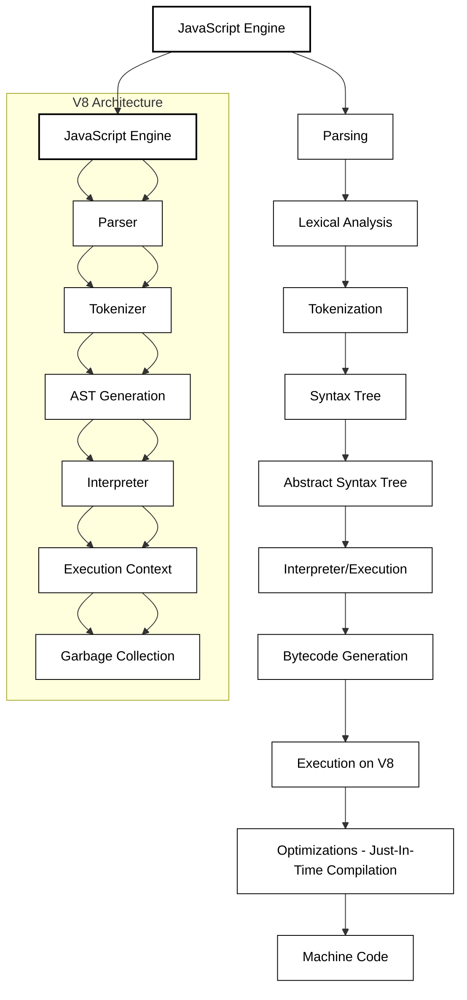

JavaScript engines are responsible for interpreting and executing JavaScript code in a web browser or server-side environment. The most well-known JavaScript engine is **Google V8**, which is used by **Google Chrome** and **Node.js**.

----

### **JS Engine Overview**

The **JavaScript Engine** is a part of the runtime environment that executes JavaScript code. It consists of multiple components:

1. **Parser**: Converts JavaScript code into an Abstract Syntax Tree (AST).
2. **Interpreter/Compiler**: Executes the code (interprets or compiles it into machine code).
3. **Memory Management**: Handles memory allocation and garbage collection.
----

### **Google V8 Architecture**

**Google V8** is an open-source JavaScript engine developed by Google for Chrome and Node.js. It is responsible for parsing, compiling, and executing JavaScript code.

The V8 architecture can be broken down into several key components:

1. **Parser**:
    
    - The parser converts JavaScript code into an **Abstract Syntax Tree (AST)**. The AST is a representation of the JavaScript code structure.
    - It checks for syntax errors in the code while parsing.
2. **Ignition (Interpreter)**:
    
    - Ignition is a lightweight interpreter that compiles JavaScript into bytecode.
    - Bytecode is an intermediate representation of the code, which is faster to execute than plain source code but not as fast as machine code.
3. **TurboFan (JIT Compiler)**:
    
    - TurboFan is the optimizing Just-In-Time (JIT) compiler in V8. It converts bytecode into optimized machine code during runtime.
    - TurboFan improves the performance by compiling frequently used functions into highly optimized machine code.
4. **Garbage Collector (GC)**:
    
    - V8’s garbage collector reclaims memory by clearing unused objects, which is essential for memory management in JavaScript.
    - **Mark-and-Sweep** is the algorithm used for garbage collection in V8.
---
### **Mark-and-Sweep Garbage Collection**

The **Mark-and-Sweep** algorithm is a **garbage collection** technique used to identify and clean up unused objects (or "garbage") in memory. Here's how it works:

#### **Step-by-Step Process**:

1. **Mark Phase**:
    - The garbage collector starts by "marking" all the objects that are reachable (i.e., objects still in use). These are the objects that are either directly referenced or reachable through other objects.
2. **Sweep Phase**:
    - After the marking phase, the garbage collector "sweeps" through the memory and clears any objects that were not marked. These are the objects that are no longer accessible or in use.

#### **Why is this important?**

- **Mark-and-Sweep** helps in identifying objects that are no longer in use and frees up memory, which optimizes performance and prevents memory leaks.
---

### **Orinoco Garbage Collector in V8**

In V8, the **Orinoco** garbage collector is responsible for performing the actual garbage collection tasks.

#### **Key Features**:

- **Generational Collection**: The heap is divided into **young** and **old** generations. New objects are allocated in the **young generation**, and objects that survive several garbage collection cycles are promoted to the **old generation**. This makes collection more efficient.
    
- **Incremental Collection**: Orinoco performs garbage collection in small chunks, allowing the application to continue running without significant pauses. This improves performance and responsiveness, especially for interactive applications.
    
- **Compaction**: After sweeping up unused objects, the garbage collector compacts the remaining objects to reduce fragmentation in memory. This ensures better memory utilization.

---
### **JS Runtime Environment**

The **JS Runtime Environment** consists of:

- **Call Stack**: The stack that manages function calls and execution contexts.
- **Heap**: The region where objects and data are stored.
- **Web APIs**: Browser-specific APIs like `setTimeout()`, `fetch()`, etc., that help handle asynchronous code.
----

### **Questions**

#### **1. What is the role of the JavaScript engine?**

**Answer**: The JavaScript engine is responsible for interpreting and executing JavaScript code. It includes a parser to convert the code into an Abstract Syntax Tree (AST), an interpreter to execute bytecode, and a JIT compiler to optimize code during runtime.

#### **2. What is the Google V8 engine?**

**Answer**: Google V8 is an open-source JavaScript engine used in Google Chrome and Node.js. It parses JavaScript, compiles it into machine code using Just-In-Time (JIT) compilation, and handles memory management using garbage collection algorithms like **Mark-and-Sweep**.

#### **3. What is the Mark-and-Sweep algorithm?

**Answer**: The **Mark-and-Sweep** algorithm is a garbage collection technique used to identify unused objects in memory. It first marks all reachable objects and then sweeps through the heap to remove those that are not marked.

#### **4. What is the Orinoco garbage collector in V8?

**Answer**: The **Orinoco** garbage collector in V8 is responsible for managing memory by performing incremental and generational garbage collection. It optimizes the process by dividing the heap into **young** and **old** generations, improving performance and reducing pauses in execution.