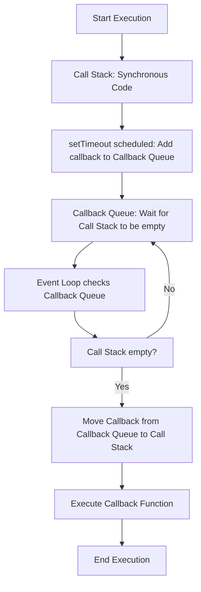

In JavaScript, **setTimeout()** is commonly used to schedule a function to run after a specified delay. However, JavaScript’s **Concurrency Model** can sometimes lead to **setTimeout()** not executing the callback function exactly after the specified delay. This happens because of the way the **Event Loop** works and the state of the **Call Stack**.

---

### **Concurrency Model in JavaScript**

JavaScript operates in a **single-threaded** environment, which means it can execute one piece of code at a time. The execution model is based on the following main components:

1. **Call Stack**: This is where the JavaScript engine keeps track of the function calls being executed. It is a LIFO (Last In, First Out) structure.
2. **Heap**: This is where objects and data are stored in memory.
3. **Callback Queue**: When asynchronous code (like `setTimeout()`) completes, its callback function is placed in the callback queue. It waits for the Call Stack to become empty before being executed.
4. **Event Loop**: The event loop continuously checks the callback queue to see if there are any functions that can be executed. It moves functions from the callback queue to the Call Stack when the Call Stack is empty.

---

### **setTimeout and Issues**

While **setTimeout()** is intended to execute the callback function after the specified delay, it doesn’t guarantee that the function will be executed exactly after that time. Instead, **setTimeout()** schedules the callback to be executed **after the delay**. However, the callback will only be executed once the **Call Stack** is empty and there are no other operations that take priority.

#### **Why these Issues?**

- **Blocking the Call Stack**: If the Call Stack is busy executing long-running synchronous code, the callback function of `setTimeout()` will not be executed until the Call Stack becomes empty.
- **Timer Precision**: The delay time specified in `setTimeout()` is a **minimum time** to wait. The actual execution of the callback may take longer, especially if there is a lot of work in the Call Stack.
- Example - 
```
console.log("Start");

setTimeout(function() {
  console.log("setTimeout executed");
}, 0);

console.log("End");
```
#### **Why this happens**:

- `console.log("Start")` is executed immediately.
- `setTimeout()` schedules the callback function, but since it has a delay of `0ms`, it will be added to the **Callback Queue**.
- The callback will only be executed once the **Call Stack** is empty, so the "End" message is printed before the callback from `setTimeout()`.

### **Understanding the Delay in setTimeout**

Even with a `0` delay, the callback function is not executed immediately. This is because:

1. The `setTimeout()` callback is placed in the **Callback Queue**.
2. The **Event Loop** only moves the callback to the **Call Stack** when the **Call Stack** is empty.
3. **Execution of other synchronous tasks** (like `console.log("End")`) takes precedence, and only after they finish does the callback from `setTimeout()` get executed.




### **Questions**

#### **1. What is the purpose of setTimeout() in JavaScript?**

**Answer**: `setTimeout()` is used to execute a callback function after a specified delay. It allows you to schedule asynchronous code to run after a minimum amount of time has passed.

#### **2. Why does setTimeout() sometimes not execute immediately after the specified delay?**

**Answer**: The callback function in `setTimeout()` is placed in the **Callback Queue** and will only execute when the **Call Stack** is empty. If there is any other code running in the Call Stack, the callback is delayed until it becomes free.

#### **3. What is the difference between the delay time set in setTimeout() and the actual execution time of the callback?**

**Answer**: The delay time in `setTimeout()` is a **minimum** time to wait. The callback function will be executed after the specified delay or when the **Call Stack** is empty, whichever is later. Other synchronous tasks in the Call Stack can delay the execution.

#### **4. What is the Call Stack, Callback Queue, and Event Loop in JavaScript?**

**Answer**:

- **Call Stack**: Where JavaScript keeps track of function calls.
- **Callback Queue**: A queue of callback functions waiting to be executed once the Call Stack is empty.
- **Event Loop**: The mechanism that checks the Callback Queue and moves functions from the queue to the Call Stack when the Call Stack is empty.