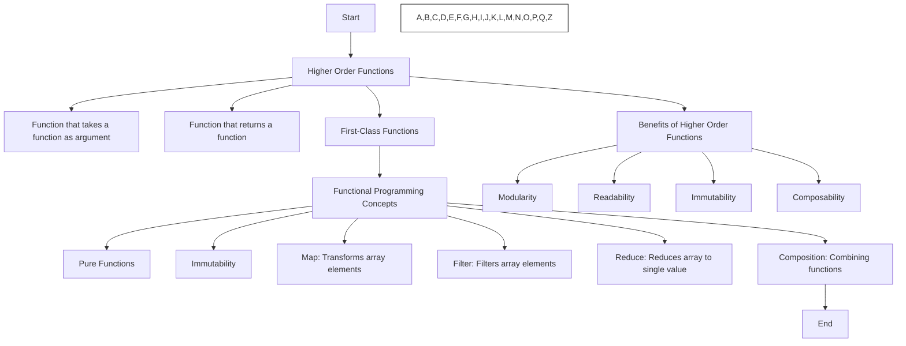

**Higher Order Functions** (HOFs) and **Functional Programming** (FP) are powerful concepts that help write more declarative and modular code.

### **Higher Order Functions (HOFs)**

A **Higher Order Function** is a function that:

- Takes one or more functions as arguments, or
- Returns a function as its result.

This allows functions to be treated as first-class citizens, enabling more flexible and reusable code.

#### **Examples of Higher Order Functions:**
1. **Function that takes a function as an argument:** 
Here, `greet` is a higher-order function because it takes a function as a parameter (`callback`).
```
function greet(name, callback) {
  console.log("Hello, " + name);
  callback();
}

greet("Alice", function() {
  console.log("Goodbye!");
});

```
2. Function that returns a function:
```
function multiplyBy(factor) {
  return function(number) {
    return number * factor;
  };
}

const multiplyBy2 = multiplyBy(2);
console.log(multiplyBy2(5)); // Output: 10
```

Here, `multiplyBy` is a higher-order function because it returns a function that multiplies its argument by a factor.

### **Functional Programming (FP)**

**Functional Programming** is a programming paradigm that treats computation as the evaluation of mathematical functions and avoids changing state and mutable data.

#### **Core Concepts of Functional Programming:**

1. **Pure Functions**: Functions that always produce the same output for the same input and do not have side effects (e.g., modifying global variables).
Example - 
```
function add(a, b) {
  return a + b;
}
```
This function is pure because it always returns the same result for the same inputs.
2. **Immutability**: In FP, data should not be changed (or mutated) directly. Instead, new data should be returned based on the current state.
Example:
```
const arr = [1, 2, 3];
const newArr = [...arr, 4]; // Creating a new array
console.log(arr); // Output: [1, 2, 3]
console.log(newArr); // Output: [1, 2, 3, 4]
```
- **First-Class Functions**: Functions can be assigned to variables, passed as arguments, or returned from other functions (which is the essence of higher-order functions).
    
- **Higher-Order Functions**: As discussed earlier, functions that take other functions as arguments or return functions.
    
- **Composition**: Composing multiple functions together to create more complex behaviors.
    
    Example:
    ```
    const add1 = (x) => x + 1;
	const double = (x) => x * 2;
	const addThenDouble = (x) => double(add1(x));
	console.log(addThenDouble(5)); // Output: 12
	```
	
	**Map, Filter, and Reduce**: These are higher-order functions that are commonly used in functional programming.

- **map**: Transforms an array by applying a function to each element.
```
const numbers = [1, 2, 3];
const doubled = numbers.map(x => x * 2);
console.log(doubled); // Output: [2, 4, 6]
```
- **filter**: Filters an array based on a condition.
```
const numbers = [1, 2, 3, 4];
const evenNumbers = numbers.filter(x => x % 2 === 0);
console.log(evenNumbers); // Output: [2, 4]
```
**reduce**: Reduces an array to a single value by applying a function.
```
const numbers = [1, 2, 3, 4];
const sum = numbers.reduce((total, current) => total + current, 0);
console.log(sum); // Output: 10
```
### **Benefits of Higher Order Functions and Functional Programming:**

1. **Modularity**: Functions are small, reusable, and easy to test.
2. **Readability**: Functional code is often more declarative, making it easier to read and understand.
3. **Immutability**: Reduces side effects and the complexity that comes with mutable data.
4. **Composability**: Functions can be combined and reused in different ways to create new behaviors.


### **Questions**
#### **1. What is a Higher Order Function?**

**Answer**: A higher-order function is a function that either takes one or more functions as arguments or returns a function as a result.

#### **2. How is Functional Programming different from Imperative Programming?**

**Answer**: Functional programming focuses on using pure functions, immutability, and avoiding side effects. Imperative programming, on the other hand, focuses on changing state and using commands to describe how to achieve a result.

#### **3. Can you give an example of a Higher Order Function?**

**Answer**: Yes, here’s an example:
```
`function applyOperation(x, operation) {   
return operation(x); }  
console.log(applyOperation(5, (x) => x * 2)); // Output: 10`
```

In this example, `applyOperation` is a higher-order function because it takes a function as an argument (`operation`).

#### **4. What is the difference between `map`, `filter`, and `reduce`?**

**Answer**:

- `map`: Transforms each element in the array.
- `filter`: Filters elements based on a condition.
- `reduce`: Reduces the array to a single value based on a function.