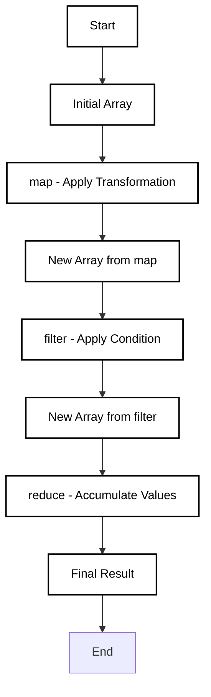

### **map()**

The `map()` method creates a new array by applying a given function to each element of the array.
###### Example:
```
const numbers = [1, 2, 3]; 
const doubled = numbers.map(num => num * 2); 
console.log(doubled); // [2, 4, 6]
```
#### **Tricky map() Scenarios**:

- **Mutating the Original Array**:
```
    let numbers = [1, 2, 3]; 
	let result = numbers.map((num, index, arr) => {arr[index] = num * 2; 
	Mutating the original array    
    return num; });  
    console.log(numbers); // [2, 4, 6] 
    console.log(result);  // [1, 2, 3] - map does not reflect mutation`
```
    
    Explanation: Mutating the original array inside `map()` does not affect the newly created array returned by `map()`.
    
- **Returning Undefined**:
    ```
    const numbers = [1, 2, 3]; 
    const result = numbers.map((num, index) => {if (index === 1) 
    return undefined;  // Return undefined for index 1     
    return num * 2; });  
    console.log(result); // [2, undefined, 6]
	```
    
    

---

### **filter()**

The `filter()` method creates a new array with all elements that pass the test implemented by the provided function.

#### Example:
```
const numbers = [1, 2, 3, 4, 5]; 
const evenNumbers = numbers.filter(num => num % 2 === 0); console.log(evenNumbers); // [2, 4]`
```

---

### **reduce()**

The `reduce()` method applies a function to each element in an array (from left to right) to reduce the array to a single value.

#### Example:
```
const numbers = [1, 2, 3, 4]; 
const sum = numbers.reduce((acc, num) => acc + num, 0); 
console.log(sum); // 10`
```
---

#### **Tricky reduce() Scenarios**:

- **Empty Array**:
    ```
    const numbers = []; 
    const sum = numbers.reduce((acc, num) => acc + num, 0); 
    console.log(sum); // 0`
	```
    **Explanation**: When reducing an empty array, `reduce()` returns the initial value provided (in this case, `0`).
    
- **Non-Commutative Operations**:
```
const numbers = [1, 2, 3]; 
const product = numbers.reduce((acc, num) => acc * num, 1); 
console.log(product); // 6
```

**Explanation**: `reduce()` works as expected for operations like multiplication, but for non-commutative operations (e.g., string concatenation), the order of the operation affects the result.
    

---

### **Chaining map(), filter(), and reduce()**

You can chain `map()`, `filter()`, and `reduce()` together for powerful transformations.

#### Example:
```
const numbers = [1, 2, 3, 4, 5];  
const result = numbers.map(num => num * 2)     // Double the numbers   
result.filter(num => num > 5)     // Filter out numbers less than or equal to 5   result.reduce((acc, num) => acc + num, 0);  // Sum the remaining numbers  console.log(result); // 18
```


**Explanation**: Chaining allows for a streamlined transformation, filtering, and accumulation process. Here, we first multiply each number by 2, then filter out numbers less than or equal to 5, and finally sum the remaining numbers.

---

### **Polyfills for map(), filter(), and reduce()**

Polyfills can be used to provide functionality that may not be available in older JavaScript environments.

#### Polyfill for `map()`:
```
if (!Array.prototype.map) {Array.prototype.map = function(callback) {
const result = [];     
for (let i = 0; i < this.length; i++) { result.push(callback(this[i], i, this));}  
return result;   }; }
```
#### Polyfill for `filter()`:
```
if (!Array.prototype.filter) {Array.prototype.filter = function(callback) {     const result = [];     
for (let i = 0; i < this.length; i++) {       
if (callback(this[i], i, this)) {result.push(this[i]);}}    
return result;   }; }`
```
#### Polyfill for `reduce()`:
```
`if (!Array.prototype.reduce) {Array.prototype.reduce = function(callback, initialValue) {let accumulator = initialValue === undefined ? this[0] : initialValue;     
for (let i = (initialValue === undefined ? 1 : 0); i < this.length; i++) {       accumulator = callback(accumulator, this[i], i, this);     
}     
return accumulator;   }; }`
```

**Explanation**: These polyfills ensure that older environments without `map()`, `filter()`, or `reduce()` methods can still use these features by adding them to `Array.prototype`.

---

### **Interview Questions**

#### **1. What is the difference between `map()` and `filter()`?**

**Answer**:

- `map()` creates a new array with transformed elements.
- `filter()` creates a new array with elements that satisfy a condition.

#### **2. What happens when you chain `map()`, `filter()`, and `reduce()` on an empty array?**

**Answer**:

- `map()` and `filter()` will return an empty array, while `reduce()` will return the accumulator's initial value if it's provided. If no initial value is provided, it will throw an error.

#### **3. Can you chain `map()` and `filter()`?**

**Answer**: Yes, `map()` and `filter()` can be chained together to transform and filter the array in a clean and concise manner.

#### **4. What is a polyfill and why is it important?**

**Answer**: A polyfill is a piece of code that provides functionality that might not be available in older environments. It’s important for ensuring compatibility across different JavaScript versions and browsers.




