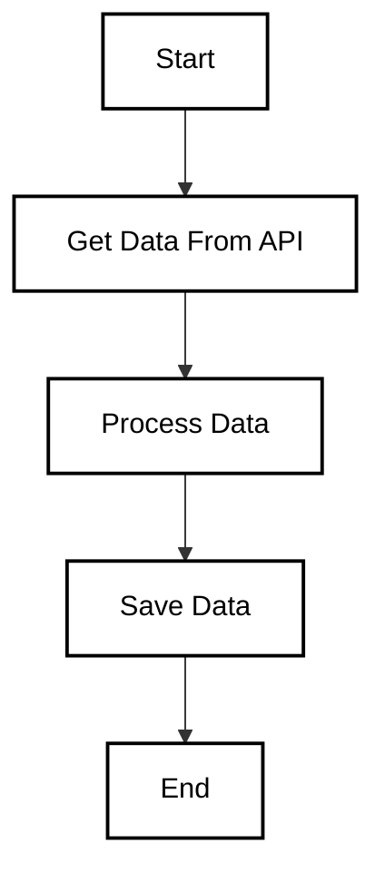

**Callback Hell** is a situation where callbacks are nested within other callbacks, leading to code that is hard to read, maintain, and debug. 
This happens often in asynchronous code, especially when multiple callbacks are involved in sequential execution, like in `setTimeout()`, `fetch()`, or event handling.
```
getDataFromAPI(function(error, data){
    if(error){
        console.error("Error fetching data");
    } else {
        processData(data, function(error, processedData){
            if(error){
                console.error("Error processing data");
            } else {
                saveData(processedData, function(error, result){
                    if(error){
                        console.error("Error saving data");
                    } else {
                        console.log("Data saved successfully");
                    }
                });
            }
        });
    }
});
```
In this example, we see nested callbacks for API data fetching, processing, and saving. This pattern leads to what is called **Callback Hell** because it results in deep nesting and poor readability.

### **Problems with Callback Hell**

1. **Readability Issues**: Deep nesting makes the code hard to read and understand.
2. **Debugging Difficulty**: Errors become hard to trace because callbacks are nested deeply.
3. **Maintenance Challenges**: Modifying the code is difficult, especially if multiple callbacks need to be adjusted.
4. **Scalability Problems**: As the logic becomes more complex, nested callbacks grow exponentially.

### **Problems with Callback Hell**

1. **Readability Issues**: Deep nesting makes the code hard to read and understand.
2. **Debugging Difficulty**: Errors become hard to trace because callbacks are nested deeply.
3. **Maintenance Challenges**: Modifying the code is difficult, especially if multiple callbacks need to be adjusted.
4. **Scalability Problems**: As the logic becomes more complex, nested callbacks grow exponentially.

### **Solutions to Avoid Callback Hell**

#### **1. Promises**

Promises provide a cleaner way to handle asynchronous operations and can help eliminate callback hell by chaining `.then()` and `.catch()` methods.
```
getDataFromAPI()
    .then(data => processData(data))
    .then(processedData => saveData(processedData))
    .then(result => console.log("Data saved successfully"))
    .catch(error => console.error("Error:", error));
```
#### **2. Async/Await**

Async/await syntax is built on top of Promises and allows you to write asynchronous code in a more synchronous style, making it more readable.

```
async function handleData() {
    try {
        const data = await getDataFromAPI();
        const processedData = await processData(data);
        await saveData(processedData);
        console.log("Data saved successfully");
    } catch (error) {
        console.error("Error:", error);
    }
}
```
This approach avoids nested callbacks and improves the readability and maintainability of your code.


### **Questions**

#### **1. What is Callback Hell?**

**Answer**: Callback Hell occurs when multiple nested callbacks are used in JavaScript, especially in asynchronous code, leading to deeply indented code that is hard to read and maintain.

#### **2. How can you avoid Callback Hell?**

**Answer**: Callback Hell can be avoided by using Promises or Async/Await to handle asynchronous operations. These approaches help to flatten the callback structure and make the code more readable.

#### **3. What is the difference between a Callback and a Promise?**

**Answer**: A callback is a function passed into another function to be executed later, while a Promise represents the eventual completion (or failure) of an asynchronous operation. Promises allow for cleaner code and easier chaining with `.then()` and `.catch()`.