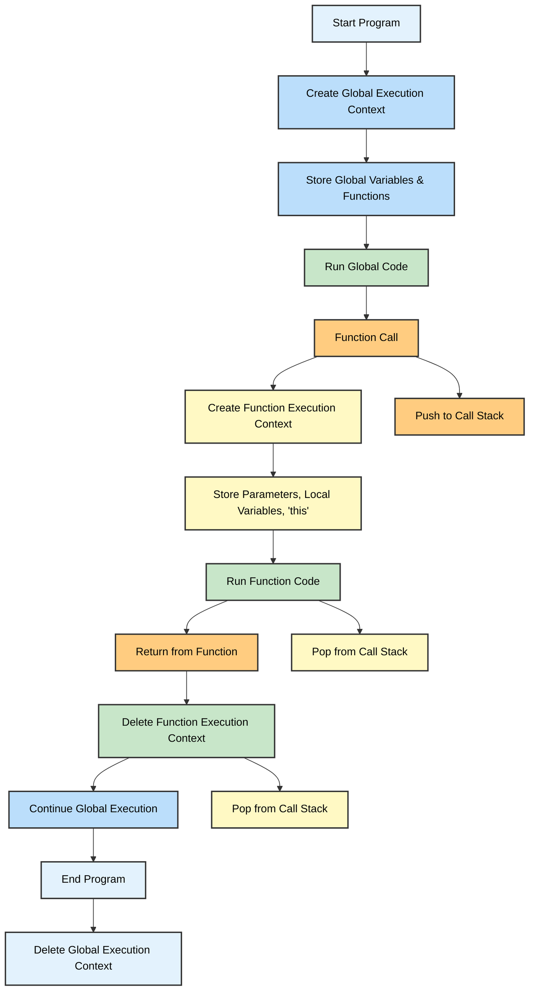

### **How JavaScript Code Executes**

JavaScript code execution follows a strict sequence to manage function calls, variable declarations, and overall program flow. This sequence is managed through the **Execution Context** and the **Call Stack**.

---

### **1. Global Execution Context (GEC)**

The **Global Execution Context** is the default context that gets created when a JavaScript program is executed. It is the first context created, and it runs the entire script.

- **When it is created**: The Global Execution Context is created when the script begins to run, and it includes global variables and functions.
- **When it is destroyed**: The GEC is destroyed once the entire program finishes executing.
---

### **2. Function Execution Context (FEC)**

When a function is called, a **Function Execution Context** is created. It contains information specific to that function, such as its local variables, parameters, and the value of `this`.

- **When it is created**: The function execution context is created whenever a function is called.
- **When it is destroyed**: The function execution context is deleted once the function finishes execution and returns a value (or simply completes its task).
---
### **3. The Call Stack**

The **Call Stack** is a data structure used by the JavaScript engine to manage function calls and execution contexts. It follows the **Last In, First Out (LIFO)** principle.

- **How it works**: Whenever a function is called, a new execution context is added to the stack. When the function finishes, its execution context is popped off the stack.
- **Role of the Call Stack**: The Call Stack helps JavaScript maintain the order of function calls and ensures that each function is executed in the correct sequence.
---

----

##  **Questions**

#### **1. What is the Global Execution Context?**

**Answer**: The Global Execution Context is created when the JavaScript program starts running. It manages global variables and functions and is deleted once the entire program finishes executing.

#### **2. What is a Function Execution Context?**

**Answer**: A Function Execution Context is created each time a function is called. It contains information about the function’s parameters, local variables, and the value of `this`. The function’s execution context is deleted once the function completes execution and returns.

#### **3. Explain the role of the Call Stack in JavaScript execution.**

**Answer**: The Call Stack is a data structure that keeps track of the execution contexts in a **Last In, First Out (LIFO)** manner. It ensures that functions are executed in the correct order, adding and removing execution contexts as functions are called and return.

#### **4. Why does the Global Execution Context get deleted?**

**Answer**: The Global Execution Context is deleted once the program finishes executing. At this point, all the code has been executed, and the global context is no longer needed.

#### **5. What happens when a function is called in JavaScript?**

**Answer**: When a function is called, a new **Function Execution Context** is created, and it is pushed onto the call stack. Once the function finishes executing, its context is popped off the stack.

----
