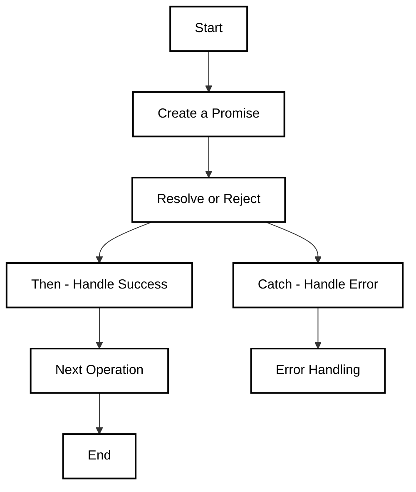

### **Promises in JavaScript**

A **Promise** in JavaScript represents the eventual completion (or failure) of an asynchronous operation and its resulting value. Promises provide a more manageable way to deal with asynchronous operations, overcoming the issues of callback hell.

### **States of a Promise**

A Promise has three states:

1. **Pending**: The Promise is still being processed.
2. **Fulfilled**: The asynchronous operation has completed successfully.
3. **Rejected**: The operation failed, and the Promise was rejected.
### **Creating a Promise**

A Promise is created using the `new Promise()` constructor, which takes a function with two arguments: `resolve` and `reject`.

```
let promise = new Promise((resolve, reject) => {
    let success = true; // Simulate a successful operation
    if (success) {
        resolve("Operation was successful!");
    } else {
        reject("Operation failed!");
    }
});
```
### **Handling Promises with `.then()` and `.catch()`**

- **`.then()`**: Used to handle the resolved value.
- **`.catch()`**: Used to handle the rejection or error.

```
promise
    .then(result => {
        console.log(result); // "Operation was successful!"
    })
    .catch(error => {
        console.error(error); // "Operation failed!"
    });
```
### **Promise Chaining**

One of the main benefits of Promises is **chaining**. You can chain multiple `.then()` calls to handle sequential asynchronous operations.
In this example, the operations are chained together, and each subsequent operation waits for the previous one to complete.
```
fetchData()
    .then(data => processData(data))
    .then(processedData => saveData(processedData))
    .then(result => console.log("Data saved successfully"))
    .catch(error => console.error("Error:", error));
```

### **Promise APIs**

JavaScript provides several built-in Promise methods to manage multiple promises more effectively:

#### **1. `Promise.all()`**

`Promise.all()` is used to execute multiple Promises in parallel. It returns a single Promise that resolves when all the Promises in the array are fulfilled, or it rejects when any one of them fails.
```
Promise.all([fetchData(), processData()])
    .then(results => {
        console.log("All promises completed:", results);
    })
    .catch(error => {
        console.error("One or more promises failed:", error);
    });
```
#### **2. `Promise.race()`**

`Promise.race()` returns a Promise that resolves as soon as the first Promise resolves or rejects.
```
Promise.race([fetchData(), processData()])
    .then(result => {
        console.log("First promise to resolve:", result);
    })
    .catch(error => {
        console.error("First promise to fail:", error);
    });
```
#### **3. `Promise.allSettled()`**

`Promise.allSettled()` returns a Promise that resolves when all the promises have settled (either fulfilled or rejected), with an array of their results.
```
Promise.allSettled([fetchData(), processData()])
    .then(results => {
        console.log("All promises settled:", results);
    });
```

#### **4. `Promise.any()`**

`Promise.any()` returns the first Promise that resolves successfully. It only rejects if all the promises fail.
```
Promise.any([fetchData(), processData()])
    .then(result => {
        console.log("First promise to succeed:", result);
    })
    .catch(error => {
        console.error("All promises failed:", error);
    });
```
### **Error Handling in Promises**

Proper error handling is important in asynchronous programming. In Promises, errors are caught using the `.catch()` method.

#### **Catching Errors**
```
let promise = new Promise((resolve, reject) => {
    reject("Something went wrong");
});

promise
    .then(result => console.log(result))
    .catch(error => console.error(error)); // Catches "Something went wrong"
```
#### **Catching Errors in Chained Promises**

In chained Promises, a single `.catch()` at the end of the chain can handle errors from any of the preceding Promises.
```
fetchData()
    .then(data => processData(data))
    .catch(error => {
        console.error("Error occurred:", error);
    });

```
#### **Try-Catch with Async/Await**

If you're using `async`/`await` syntax, you can use `try-catch` blocks to handle errors.

```
async function fetchDataAndProcess() {
    try {
        const data = await fetchData();
        const processedData = await processData(data);
        console.log(processedData);
    } catch (error) {
        console.error("Error:", error);
    }
}
```



### **Questions**

#### **1. What is a Promise in JavaScript?**

**Answer**: A Promise is an object representing the eventual completion or failure of an asynchronous operation. It has three states: pending, fulfilled, and rejected.

#### **2. What is Promise chaining?**

**Answer**: Promise chaining allows you to perform a sequence of asynchronous operations, where each operation waits for the previous one to complete, using `.then()`.

#### **3. What is the difference between `Promise.all()` and `Promise.race()`?**

**Answer**: `Promise.all()` resolves when all promises are fulfilled, while `Promise.race()` resolves as soon as the first promise is fulfilled or rejected.

#### **4. How does error handling work in Promises?**

**Answer**: Errors are caught using the `.catch()` method, which handles any errors that occur in any of the chained Promises.