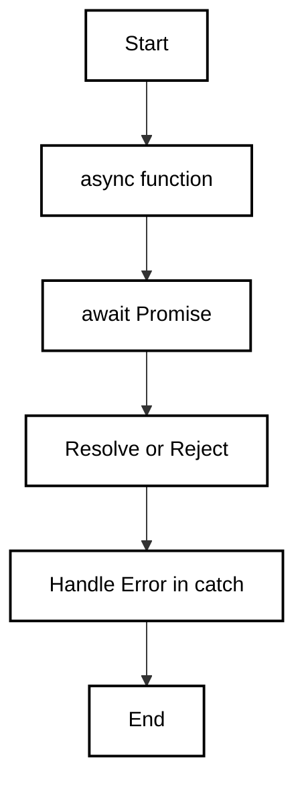

`async` and `await` are modern JavaScript features that simplify working with asynchronous code. They are built on top of Promises and offer a more readable and synchronous-like structure, making asynchronous code easier to write and understand.

### **Async and Await in JavaScript**

`async` and `await` are modern JavaScript features that simplify working with asynchronous code. They are built on top of Promises and offer a more readable and synchronous-like structure, making asynchronous code easier to write and understand.

---

### **What is Async?**

An `async` function is a function that implicitly returns a Promise. It allows you to write asynchronous code using `await` inside the function, which pauses the execution of the function until the Promise is resolved or rejected.

- The `async` keyword is used to define a function that always returns a Promise.
- It ensures that the function will return a Promise, even if you return a non-Promise value explicitly from the function.

```
async function fetchData() {
    return "Data fetched!";
}

fetchData().then(data => console.log(data)); // Output: Data fetched!

```

### **What is Await?**

The `await` keyword can only be used inside `async` functions. It pauses the execution of the function and waits for a Promise to resolve or reject.

- `await` makes the code look synchronous, but it still behaves asynchronously.
- It allows you to wait for a Promise to resolve before moving to the next line of code.

#### Example:
In this example, `await` pauses the execution of `fetchData()` until the `fetch()` Promise resolves, and then logs the data.
```
async function fetchData() {
    let data = await fetch('https://api.example.com/data'); // wait for the fetch Promise to resolve
    console.log(data); // Logs the resolved value
}

fetchData();

```
### **Error Handling with Async/Await**

Error handling with `async`/`await` is done using the `try-catch` block, just like synchronous code.

#### Example:
```
async function fetchData() {
    try {
        let response = await fetch('https://api.example.com/data');
        let data = await response.json();
        console.log(data);
    } catch (error) {
        console.error("Error fetching data:", error);
    }
}

fetchData();
```
In this case, if an error occurs during the `fetch()` or `.json()` operation, it will be caught by the `catch` block.

### **Async/Await with Promise Chaining**

`async` and `await` simplify Promise chaining, making it look cleaner and more readable.

#### Example:
```
async function processData() {
    try {
        let data = await fetch('https://api.example.com/data');
        let processedData = await data.json();
        console.log(processedData);
    } catch (error) {
        console.error("Error:", error);
    }
}

processData();
```
The above example is functionally equivalent to Promise chaining but in a more synchronous-like format, improving readability.
### **Concurrent Async/Await**

Although `await` makes your code look sequential, you can still run asynchronous operations concurrently by not waiting for each operation to finish before starting the next one.

#### Example:
```
async function fetchData() {
    let response1 = fetch('https://api.example1.com');
    let response2 = fetch('https://api.example2.com');

    let data1 = await response1;
    let data2 = await response2;

    console.log(data1, data2);
}

fetchData();
```
Here, `response1` and `response2` are fetched concurrently, and the function only waits for their responses afterward. This improves performance by making asynchronous calls in parallel rather than waiting for one to finish before starting the next.

### **Async/Await in Loops**

You can use `async/await` within loops for asynchronous operations. However, if you use `await` inside a `for` loop, it will execute one iteration at a time. If you want to run them concurrently, you can use `Promise.all()`.

#### Example with Sequential Execution (one by one):
```
async function fetchData() {
    const urls = ['url1', 'url2', 'url3'];
    for (let url of urls) {
        let response = await fetch(url); // waits for each fetch to finish before starting the next
        console.log(await response.json());
    }
}

fetchData();
```
Example with Concurrent Execution (all at once):
```
async function fetchData() {
    const urls = ['url1', 'url2', 'url3'];
    const promises = urls.map(url => fetch(url));
    const responses = await Promise.all(promises); // executes all fetch calls concurrently
    responses.forEach(response => console.log(response));
}

fetchData();
```

### **Questions**

#### **1. What is the difference between `async`/`await` and Promises?**

**Answer**: `async` and `await` are syntactic sugar over Promises. They make asynchronous code look more like synchronous code. `async` ensures the function returns a Promise, and `await` pauses the function until the Promise resolves. Promises use `.then()` and `.catch()` for handling resolved and rejected values.

#### **2. Can we use `await` outside an `async` function?**

**Answer**: No, `await` can only be used inside `async` functions. Using `await` outside of an `async` function will throw a syntax error.

#### **3. How do you handle errors in async functions?**

**Answer**: Errors in `async` functions are handled using a `try-catch` block, similar to synchronous code.

#### **4. What happens if a function marked with `async` doesn’t return a Promise?**

**Answer**: If an `async` function doesn't explicitly return a Promise, it automatically returns a Promise that resolves with the value returned by the function.