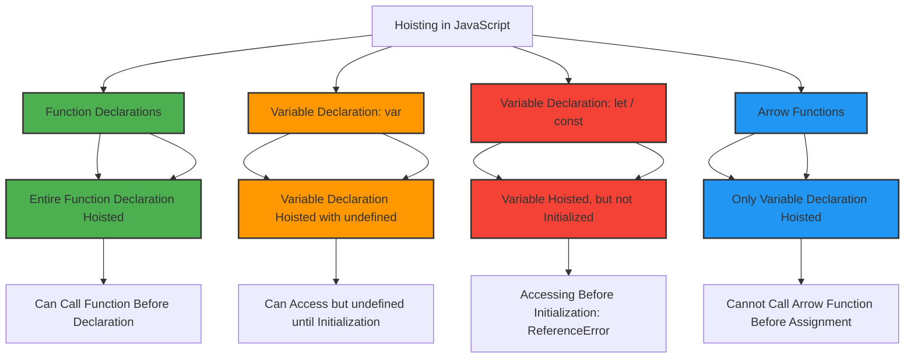

### **Hoisiting in JavaScript**

Hoisting is a JavaScript mechanism where variables and function declarations are moved to the top of their containing scope during the compile phase, before the code has been executed.

---
### **What is Hoisting?**

In JavaScript, variable and function declarations are **hoisted** to the top of their scope, which means that you can refer to variables or functions before they are declared. However, only the declarations are hoisted, not the initializations.

Example - 
- The declaration `var x` is hoisted to the top, but the initialization `x = 5` stays in place.
- Before the initialization, `x` is `undefined`.

```
console.log(x); // undefined 
var x = 5; 
console.log(x); // 5
```
---
#### Hoisting with Functions:

Hoisting works slightly differently with function declarations. The entire function definition is hoisted, allowing you to call the function before its declaration.

Example - 
- In this case, the entire `hello` function is hoisted to the top, allowing it to be called before its definition.
```
hello();  // "Hello, World!"
function hello() {
  console.log("Hello, World!");
}
```
---

### **Hoisting with `let` and `const`**

Variables declared with `let` and `const` are **hoisted** but not initialized. They enter a "temporal dead zone" (TDZ) from the start of the block until the line where the variable is initialized.

Example: In this case 
- Trying to access `a` before its initialization results in a **ReferenceError**, because `let` variables are hoisted to the top of their scope but are not accessible until they are initialized.
```
console.log(a);  // ReferenceError: Cannot access 'a' before initialization
let a = 10;
```

---
### **Arrow Functions vs Normal Functions (Hoisting)**

#### **Normal Functions**

Normal functions (function declarations) are fully hoisted, meaning both the function definition and the body are moved to the top of the scope.

Example - The function declaration is hoisted completely, so `greet()` can be called before its definition.
```
greet();  // "Hello, World!"

function greet() {
  console.log("Hello, World!");
}
```

#### **Arrow Functions**

Arrow functions, on the other hand, are **not hoisted** in the same way. When you assign an arrow function to a variable, only the variable declaration is hoisted, not the function expression.

Example - In this case, only `var greet` is hoisted, but the function assignment `() => { console.log("Hello, World!"); }` happens at runtime, resulting in an error when calling the function before its definition.
```
greet();  // TypeError: greet is not a function

var greet = () => {
  console.log("Hello, World!");
};
```
---

#### Why this difference?

- **Normal functions** are hoisted because they are function declarations, which are part of the language's structure.
- **Arrow functions** are treated as expressions assigned to variables, so only the variable declaration is hoisted (not the function definition).
---



### **Questions**

#### **1. What is hoisting in JavaScript?**

**Answer**: Hoisting is a JavaScript behavior where variable and function declarations are moved to the top of their scope before execution. Variables declared with `var` are hoisted with an initial value of `undefined`, while `let` and `const` are hoisted but not initialized. Function declarations are fully hoisted, meaning both the declaration and the body are moved to the top.

#### **2. What happens when you try to access a variable before it is declared using `let` or `const`?**

**Answer**: Trying to access a `let` or `const` variable before its declaration will result in a `ReferenceError` because these variables are hoisted but not initialized, and they enter the "temporal dead zone" from the start of the block until initialization.

#### **3. Can you call a function before it is declared?**

**Answer**: Yes, if the function is declared using a **function declaration** (e.g., `function greet() { ... }`), it can be called before its declaration because the entire function is hoisted to the top.

#### **4. What is the difference between normal functions and arrow functions in terms of hoisting?**

**Answer**:

- Normal functions (function declarations) are hoisted entirely, so you can call them before their declaration.
- Arrow functions are **not hoisted** in the same way; only the variable they are assigned to is hoisted, not the function itself. This means you cannot call an arrow function before its declaration.