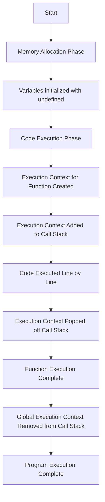

### **Step-by-Step Function Execution**

When a function is invoked, JavaScript follows a specific sequence of steps to execute the code inside it. This process involves the **Call Stack** and the **Execution Context**. Here's how it works:
#### **1. Memory Allocation Phase**

When the JavaScript code starts executing, the **Memory Allocation Phase** occurs first. During this phase:

- Variables and functions are allocated in memory.
- The variables are assigned the value `undefined` before the actual execution of code begins.

Example: In the memory phase, JavaScript knows `a` exists but hasn't assigned a value to it yet (hence `undefined`).
```
var a; 
function greet() { 
console.log("Hello!"); 
}
```

#### **2. Code Execution Phase**

Once memory allocation is done, JavaScript moves on to the **Code Execution Phase**. This is where the code starts running line by line, starting from the top:

- The JavaScript engine evaluates and runs each line of code in the order they appear.

Example - In the execution phase, `a` is assigned the value `10` and the function `greet()` is called.
```
var a = 10; 
greet();
```

---
#### **3. Execution Context Created for Functions**

When a function is invoked, a new **Execution Context** is created specifically for that function. This is where the function's local variables and the code inside it are processed.

- **Global Execution Context (GEC)**: The default execution context where all JavaScript code runs when not inside any function.
- **Function Execution Context (FEC)**: Created when a function is called. It holds the function's variables and functions, and handles its execution.
----
#### **4. Execution Context Added to the Call Stack**

Once the execution context for the function is created, it is pushed onto the **Call Stack**. The **Call Stack** keeps track of the currently executing code. When a function is invoked, the context for that function is added to the top of the stack.

- The **Call Stack** ensures that JavaScript executes one function at a time, keeping track of the execution order.
---

#### **5. Function Code Execution**

The code inside the function is then executed. If the function contains any further function calls, new execution contexts are created for those functions as well, and they are added to the **Call Stack**.

Example: Here, `outer()` creates an execution context, and when `inner()` is called, its own execution context is added to the call stack.
```
function outer() {
  var x = 10;
  inner();

  function inner() {
    var y = 20;
    console.log(x + y);
  }
}
outer();
```
#### **6. Execution Context Removed from Call Stack**

Once the function has finished executing, its execution context is popped off the **Call Stack**. This marks the end of the function execution.

- If there are no more functions to execute, the program ends.
----

#### **7. Program Execution Completed**

Finally, when the main program finishes executing, the **Global Execution Context (GEC)** is also removed from the **Call Stack**, and the program ends.

---
### **Flow of Execution Example**

Consider the following simple example:
```
var a = 5;
function greet() {
  console.log("Hello, World!");
}
greet();
```
- **Step 1**: The **Memory Allocation Phase** initializes `a` as `undefined` and defines the `greet()` function.
- **Step 2**: The **Code Execution Phase** assigns `5` to `a` and calls the `greet()` function.
- **Step 3**: The **Execution Context** for `greet()` is created and pushed onto the **Call Stack**.
- **Step 4**: The `console.log` statement inside `greet()` is executed.
- **Step 5**: Once `greet()` finishes, its **Execution Context** is popped off the **Call Stack**, and the program finishes.



### **Questions**

#### **1. What is an Execution Context in JavaScript?**

**Answer**: An execution context is the environment in which JavaScript code is evaluated and executed. There are two types: the **Global Execution Context (GEC)** and the **Function Execution Context (FEC)**. The execution context is created when the code runs and is pushed to the **Call Stack**.

#### **2. What happens when a function is invoked in JavaScript?**

**Answer**: When a function is called, a new **Function Execution Context (FEC)** is created and pushed onto the **Call Stack**. The function's code is then executed, and after completion, its execution context is removed from the stack.

#### **3. Explain the Call Stack in JavaScript.**

**Answer**: The **Call Stack** is a data structure that manages the execution contexts of functions in JavaScript. It ensures that functions are executed in the order they are called, and once a function is completed, its execution context is removed from the stack.

#### **4. What is the difference between Global Execution Context and Function Execution Context?**

**Answer**:

- **Global Execution Context (GEC)**: The default context in which all JavaScript code runs.
- **Function Execution Context (FEC)**: Created whenever a function is called, and it contains the variables and code specific to that function.