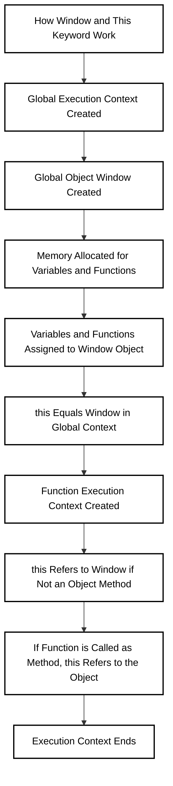

In JavaScript, the **Window** object refers to the global object in a browser environment. It is the highest-level object in the global scope and provides access to many essential browser APIs such as document manipulation, timers, and location handling.

When JavaScript executes in an empty file, the **JS Engine** follows a series of steps:

 **1. Creation of Global Execution Context (GEC)**:  
 - The JS engine creates the Global Execution Context (GEC).
 - It allocates memory and prepares the environment to execute code.
 - Functions and variables are stored in this context.
 
 **2. Global Object - Window**:
    
- The **Window** object is created along with the GEC. This object acts as a container for all globally accessible variables and functions.
- All globally declared variables and functions are properties of the Window object.

#### **this Keyword**

- **this** refers to the context in which a function is called, and it can have different values depending on where and how it is used.

-  **Global Context**: When `this` is used in the global execution context (outside of any functions), it refers to the **Window** object in the browser.  

- **Function Context**: Inside a function, `this` will refer to the object calling the function. If the function is not called as a method of an object, `this` will still refer to the **Window** object in a browser.
        
Example: - - **this in Event Handlers**: In event handlers, `this` refers to the element that fired the event.
```
// In global context:
console.log(this);  // Outputs the global Window object

// In function context:
function test() {
    console.log(this); // Outputs the global Window object, unless called from an object
}
test();
```



### **Questions**

#### **1. What is the Window object in JavaScript?**

**Answer**: The **Window** object represents the global object in a browser environment. It is automatically created when the JavaScript engine initializes and holds all global variables, functions, and objects. It also provides access to various browser-specific features, such as the DOM (Document Object Model) and window-related methods.

---

#### **2. What does the **this** keyword refer to in JavaScript?**

**Answer**: The **this** keyword refers to the context in which a function is executed. It can have different values depending on the execution context:

- In the **global context**, **this** refers to the **Window** object in browsers.
- In a **function context**, **this** refers to the object calling the function, or the **Window** object if it's called in the global context.
- In **event handlers**, **this** refers to the element that triggered the event.

---

#### **3. What happens when you access **this** in the global context in a browser?**

**Answer**: In the global execution context, **this** refers to the **Window** object in a browser environment. So, if you use **this** outside of any function or method, it will point to the **Window** object.

---

#### **4. How does **this** behave inside a function?**

**Answer**: Inside a function, **this** refers to the object that invoked the function (if the function is invoked as a method of an object). If the function is called directly in the global context, **this** will still refer to the **Window** object in browsers. However, if the function is invoked using `call()`, `apply()`, or `bind()`, **this** can be explicitly set to another object.

---

#### **5. Can *this* be changed in JavaScript?**


**Answer**: Yes, the value of **this** can be explicitly changed using methods like `call()`, `apply()`, and `bind()`. These methods allow you to change the context in which **this** is evaluated:

- `call()`: Immediately invokes the function with a specified **this** value and arguments.
- `apply()`: Similar to `call()`, but arguments are passed as an array.
- `bind()`: Returns a new function with a specified **this** value, but does not invoke it immediately.

---

#### **6. How does *this* work in event handlers?**

**Answer**: In event handlers, **this** refers to the DOM element that triggered the event. For example, if a button's `click` event is triggered, **this** inside the event handler would refer to the button element itself.

```
const button = document.querySelector("button");
button.addEventListener("click", function() {
    console.log(this);  // 'this' refers to the button element
});
```

