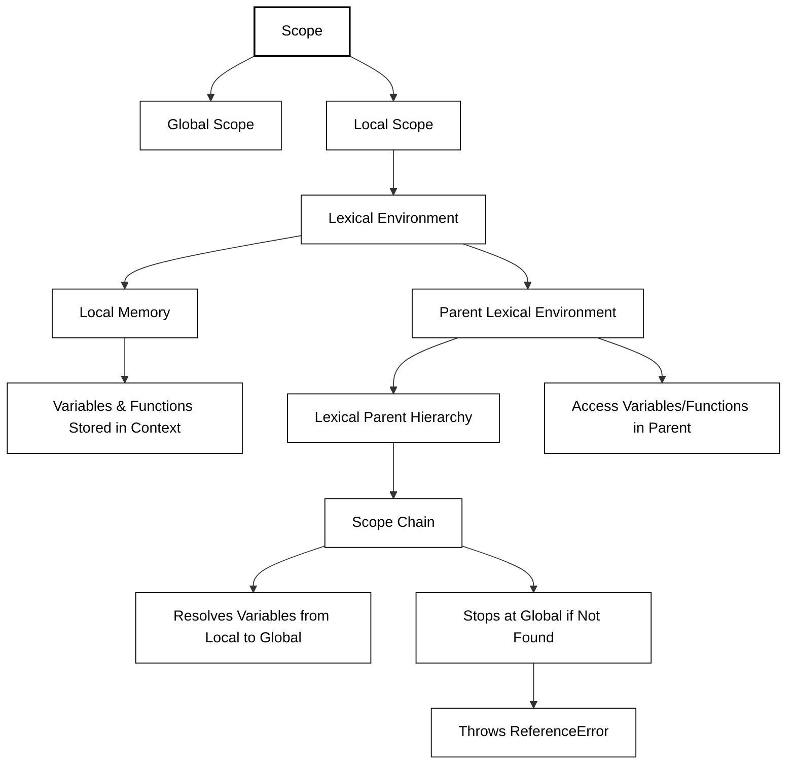

#### **1. What is Scope?**

- **Definition**: Scope defines where you can access specific variables or functions in the code.
- **Types of Scope**:
    - **Global Scope**: Variables declared outside any function or block can be accessed anywhere.
    - **Local Scope**: Variables declared inside a function or block are accessible only within that specific context.

---

#### **2. Lexical Environment**

- **Definition**: Lexical Environment is a combination of:
    - **Local Memory**: Where the function’s variables and functions are stored.
    - **Lexical Parent’s Environment**: The environment of the parent context where the function is defined.
- **Lexical Hierarchy**:
    - The term "lexical" refers to the order or hierarchy of functions and their placement in the code.
- Example - 
```
function a() {
  let x = 10;
  function b() {
    console.log(x); // Accesses 'x' from parent lexical environment
  }
  b();
}
a();
```
#### **3. Scope Chain**

- **Definition**: The chain of lexical environments used to resolve variable or function access is called the **scope chain**.
- **How It Works**:
    - When a variable or function is accessed, JavaScript looks for it in the local lexical environment.
    - If not found, it moves up the chain to the parent environment.
    - This process continues until the global environment is reached or the variable is found.
----
### **Key Formula**

**Lexical Environment = Local Memory + Lexical Environment of Parent**

----
#### **4. Why Does the Scope Chain Matter?**

- Determines whether a variable or function is **in scope** (accessible) or **out of scope** (not accessible).
- Prevents unwanted access to variables outside their defined context.
- Promotes modular and maintainable code by restricting access based on hierarchy.



---
### **Questions**

1. **What is a Lexical Environment in JavaScript?**
    
    - **Answer**: A Lexical Environment is a structure that contains a local memory space and a reference to the parent lexical environment.
2. **What is the scope chain?**

    - **Answer**: The scope chain is the sequence of lexical environments used to resolve variable or function access.
3. **Can a function access variables from the global scope?**
    
    - **Answer**: Yes, functions can access variables from the global scope, but variables declared in the function are not accessible in the global scope.
4. **What happens if a variable is not found in the scope chain?**
    
    - **Answer**: If a variable is not found in the scope chain, JavaScript throws a `ReferenceError`.
5. **What is the difference between Global Scope and Local Scope?**
    
    - **Answer**:
        - Global Scope: Variables accessible throughout the program.
        - Local Scope: Variables accessible only within a specific block or function.

```
// Example of Scope Chain
function outer() {
  let a = 10;
  function inner() {
    console.log(a); // Accesses 'a' from outer's lexical environment
  }
  inner();
}
outer();

// Scope Chain in Action
let x = 20; // Global Scope
function func1() {
  let y = 30; // Local Scope
  console.log(x + y); // Accesses 'x' from global scope
}
func1();

```
