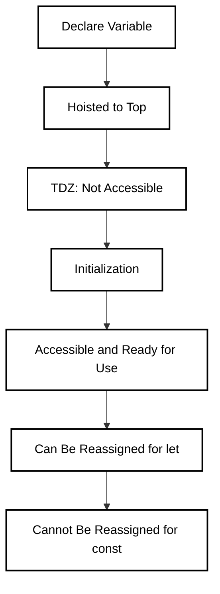

### **1. Block Scope vs Function Scope**

#### **Let and Const**:

Both **`let`** and **`const`** are **block-scoped**. This means they are only accessible within the block (e.g., loop or function) in which they are defined.
#### **Var**
**`var`** is **function-scoped**, meaning it is accessible throughout the entire function in which it is declared.
Example - **`let`** and **`const`** are confined to the block, while **`var`** is accessible outside of the block.
```
if (true) {
  let x = 10;
  const y = 20;
  var z = 30;
}
console.log(x); // ReferenceError: x is not defined
console.log(y); // ReferenceError: y is not defined
console.log(z); // 30
```
### **2. Temporal Dead Zone (TDZ)**

#### **Explanation**:

Both **`let`** and **`const`** are hoisted to the top of their scope but are **not accessible** until they are initialized with a value. This period of uninitialized state is called the **Temporal Dead Zone (TDZ)**. Trying to access a variable before initialization results in a **ReferenceError**.
Example - 
```
console.log(a); // ReferenceError: Cannot access 'a' before initialization
let a = 10;
console.log(b); // ReferenceError: Cannot access 'b' before initialization
const b = 20;
```
### **3. Assignment and Mutability**

- **`let`**: Can be reassigned new values.
- **`const`**: Cannot be reassigned once a value is assigned, enforcing immutability.

Example -
```
let c = 30;
c = 40; // Reassignment is allowed
const d = 50;
d = 60; // TypeError: Assignment to constant variable.
```
### **4. Errors: TypeError, ReferenceError, SyntaxError**

- **TypeError**: Happens when trying to **reassign** a `const` variable.
- **ReferenceError**: Occurs when accessing a variable **before** it is initialized.
- **SyntaxError**: Happens when a `const` variable is declared **without initialization**.
Example - 
```
// TypeError
const e = 100;
e = 200; // TypeError: Assignment to constant variable.

// ReferenceError
console.log(f); // ReferenceError: Cannot access 'f' before initialization
let f = 300;

// SyntaxError
const g; // SyntaxError: Missing initializer in const declaration
```

### **Best Practices** **/ Conclusion**

- **Use `const`** whenever you don’t intend to reassign the value of a variable. This makes the code more predictable and readable.
- **Use `let`** when the value of the variable is expected to change.
- Avoid **`var`** due to its function scoping and potential confusion.


### **Probable Interview Questions**

#### **1. What is the Temporal Dead Zone in JavaScript?**

**Answer**: The Temporal Dead Zone (TDZ) refers to the period from when a variable is hoisted to the top of its scope until it is initialized. During this period, attempting to access the variable results in a `ReferenceError`.

#### **2. Can you reassign a `const` variable?**

**Answer**: No, a `const` variable cannot be reassigned. Once it is initialized, its value is constant and cannot be changed.

#### **3. What is the difference between `let`, `const`, and `var`?**

**Answer**:

- **`let`**: Block-scoped and can be reassigned.
- **`const`**: Block-scoped, cannot be reassigned, and promotes immutability.
- **`var`**: Function-scoped, hoisted, and can lead to unintended behavior.

#### **4. What happens if you try to use a `let` or `const` variable before it is initialized?**

**Answer**: A `ReferenceError` occurs if you try to access a `let` or `const` variable before it is initialized due to the Temporal Dead Zone (TDZ).