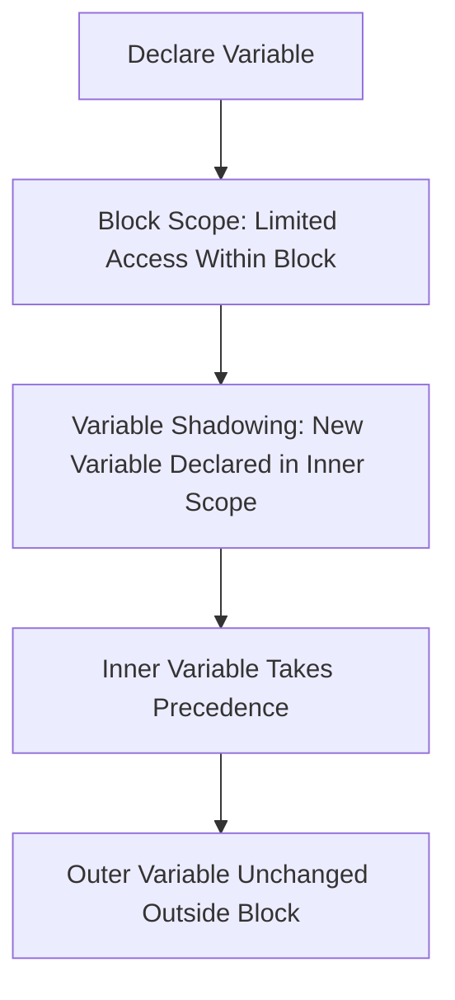

JavaScript allows grouping multiple statements within a **block** using curly braces `{}`. The block scope determines the accessibility of variables declared inside it, and **shadowing** occurs when a variable is re-declared inside a nested scope, hiding the outer variable.

----

### **1. Block Scope**

A **block** in JavaScript is a set of statements wrapped in curly braces `{}`. This is commonly used in control structures like `if`, `for`, and `while`. Variables declared with `let` and `const` inside a block are only accessible within that block, meaning they have **block scope**.

#### Example:
Variables `x` and `y` are **block-scoped** and cannot be accessed outside of the `if` block.
```
if (true) {
  let x = 10;
  const y = 20;
  console.log(x);  // 10
  console.log(y);  // 20
}

console.log(x);  // ReferenceError: x is not defined
console.log(y);  // ReferenceError: y is not defined
```
### **2. Shadowing**

**Shadowing** occurs when a variable declared in a nested block or scope has the same name as a variable in the outer scope. The inner variable **shadows** or **overwrites** the outer variable within its scope.
Example: 
- Inside the `if` block, the variable `a` is **shadowed** by the new `a = 10`.
- The **outer `a`** is not affected by the inner block's declaration.
```
let a = 100;

if (true) {
  let a = 10;  // Shadowing the outer variable 'a'
  console.log(a);  // 10 (inner variable takes precedence)
}

console.log(a);  // 100 (outer variable is unaffected)
```
### **3. Block Scope in Loops**

Using `let` or `const` inside loops ensures that the variables are **block-scoped** and not shared across iterations, unlike `var`.
Example: - The variable `message` is accessible only within the loop, as it is block-scoped due to the `let` declaration.
```
for (let i = 0; i < 3; i++) {
  let message = `Iteration ${i}`;
  console.log(message);  // Iteration 0, Iteration 1, Iteration 2
}

console.log(message);  // ReferenceError: message is not defined

```

### **Probable Interview Questions**

#### **1. What is block scope in JavaScript?**

**Answer**: Block scope refers to the scope of a variable declared inside a block (denoted by curly braces `{}`). Variables declared with `let` or `const` are accessible only within the block and not outside.

#### **2. What is variable shadowing in JavaScript?**

**Answer**: Shadowing occurs when a variable in an inner scope has the same name as a variable in the outer scope, causing the inner variable to hide or overwrite the outer variable within the inner scope.

#### **3. How does block scope affect variable visibility in loops?**

**Answer**: When using `let` or `const` inside a loop, the variables are confined to the loop block and not shared across iterations. This prevents unexpected behavior compared to `var`, which is function-scoped and can cause variable leakage.

#### **4. Can variables declared with `let` or `const` be accessed outside their block scope?**

**Answer**: No, variables declared with `let` or `const` are only accessible within the block in which they are defined. Attempting to access them outside the block results in a **ReferenceError**.